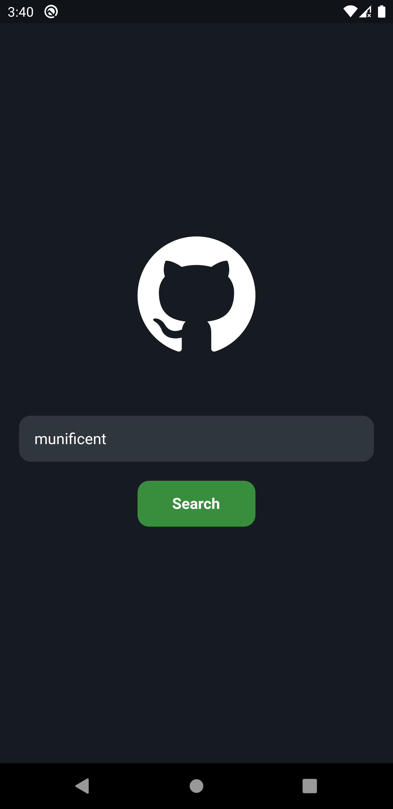
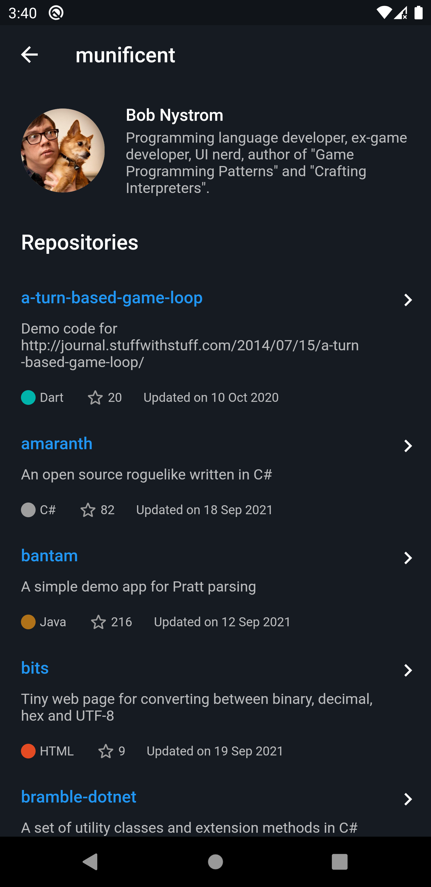
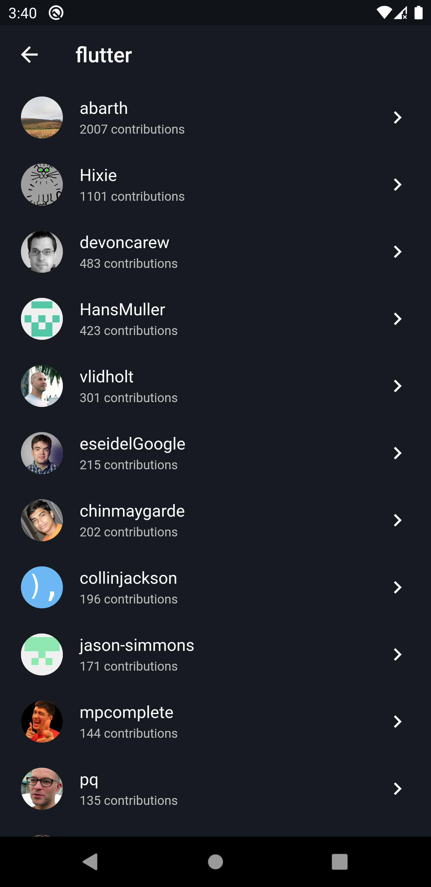

# 🌐 Github Profile

<div>
  
  
  
</div>

## 📲 Getting Started

### Installing

**Cloning the Repository**

```
$ https://github.com/gabrielvictorjs/github_profile.git

$ cd github_profile
```

**Installing dependencies**

```
$ flutter pub get
```

**Running**

```
$ flutter run
```

## ⚙ Build With

Flutter SDK v2.5.1

- [Flutter Hooks](https://pub.dev/packages/flutter_hooks) Object that manages a `Widget` life-cycles
- [Hooks Riverpod](https://pub.dev/packages/hooks_riverpod) State and dependency manager
- [Dartz](https://pub.dev/packages/dartz) Functional programing elements in dart
- [Equatable](https://pub.dev/packages/equatable) Equality comparison simplifier
- [Freezed](https://pub.dev/packages/freezed) Code generator for unions/pattern-matching/copy
- [http](https://pub.dev/packages/http) Http client for Dart
- [Flutter Svg](https://pub.dev/packages/flutter_svg) SVG rendering
